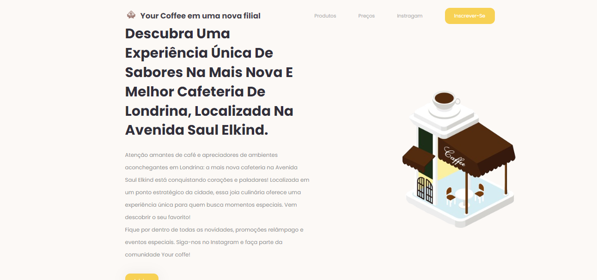
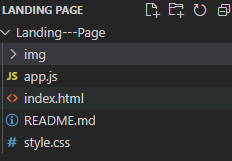

# Landing---Page

𝐍𝐨𝐰 𝐥𝐨𝐚𝐝𝐢𝐧𝐠...

# Índice🗝️
   - [trabalho de recuperação - Landing Page ](#trabalho-de-recupera%C3%A7%C3%A3o----lan-page)  
   - [Descrição](#descri%C3%A7%C3%A3o)  
   - [Introdução](#introdu%C3%A7%C3%A3o)  
   - [Funcionalidades](#funcionalidades)
   - [codigos](#codigos)
   - [Tecnologias Utilizadas](#tecnologias-utilizadas)  
   - [Fontes Consultadas](#fontes-consultadas)  
   - [Autores](#autores)  

   ┕━»•» 🌺 «•«━━━━━┙

# trabalho de recuperação -  Landing Page 🚀

## DESCRIÇÃO.♡ 🦋
Desenvolver uma página do tipo Landing Page para o estabelecimento comercial recém-inaugurado na Saul Elkind, especificamente uma cafeteria. O propósito primordial da referida página é apresentar promoções, bem como informar e promover os produtos e serviços oferecidos pelo novo empreendimento aos potenciais consumidores da localidade circunvizinha. A mencionada página será utilizada como meio de divulgação para anunciar o início das operações do negócio por meio do perfil institucional no Instagram da empresa.

╚══ ❀•°❀°•❀ ══╝

## Introdução🌟
Esta landing page apresenta informações atrativas e relevantes acerca do novo empreendimento localizado na Saul Elkind, estabelecendo um ambiente online destinado à divulgação dos serviços oferecidos pela cafeteria.

┏━━━•❃°•°❀°•°❃•━━━┓

## Funcionalidades🌺
- A página inicial destina-se a disponibilizar informações relativas à cafeteria.
- Tem como objetivo atrair a atenção dos potenciais clientes.
- Proporciona a exposição dos produtos e serviços oferecidos pela cafeteria.
- Integra links de navegação com o intuito de facilitar o acesso às diversas seções da página.
- Incentiva os visitantes a explorarem mais detalhadamente os produtos oferecidos.

╔══════ ❀•°❀°•❀ ══════╗

## CODIGOSꕥ

**index.html:** Este documento constitui a página principal da aplicação, incorporando a estrutura HTML essencial e referências aos estilos e scripts necessários.

**style.css:**  Arquivo em linguagem CSS incumbido da formatação estilística e disposição visual da página.

**app.js:** Arquivo JavaScript destinado a administrar a funcionalidade relacionada ao modo claro/escuro.

**/img:** Diretório que armazena imagens utilizadas na composição da página.

╚════ ❀ ✿ ღღ ❀ ✿ ════╝

### Tecnologias Utilizadas🌐
°HTML5    
°CCS3       
°JS   

❁•❁•❁•❁•❁•❁•❁•❁•❁•❁•❁•❁

## Fontes Consultadas🔍
[Inteligência Artifcial](https://chat.openai.com/)     
[youtube](https://youtu.be/RaITAxEdTDY?si=SYE6ZOLW1EYN8arR)       
[répositorio github](https://gist.github.com/lohhans/f8da0b147550df3f96914d3797e9fb89)    

✧❁❁✧✿✿✧❁❁✧

## Autores💮
 [Nicolly da Silva Davila 2'A](https://github.com/NickSilvaDavila)